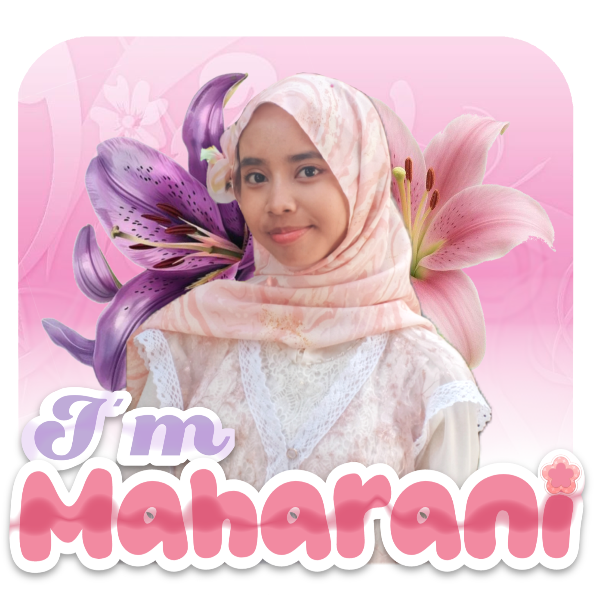
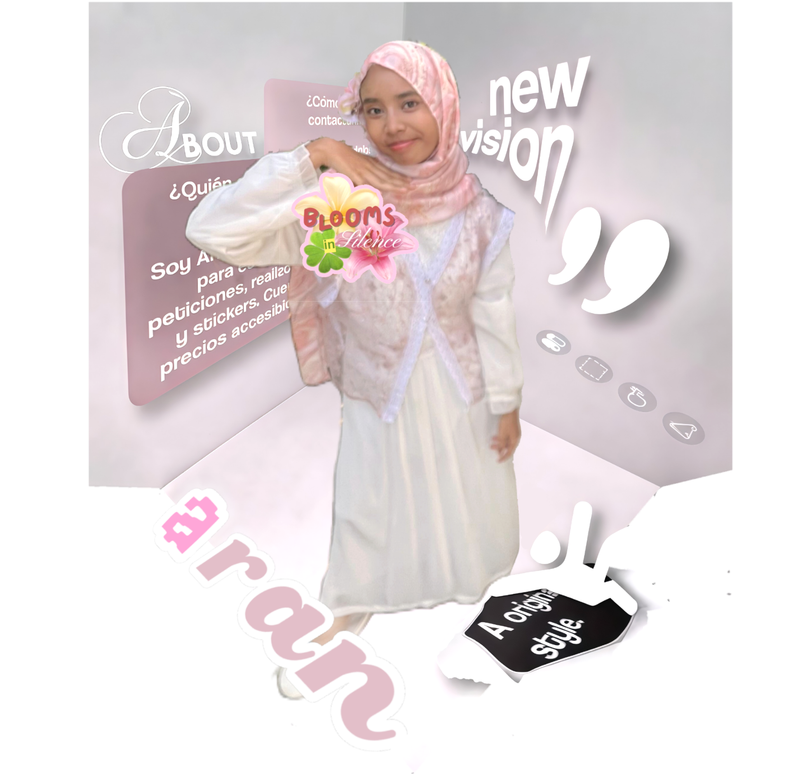

  

  

  

  <b>Software Engineering Student</b> ✦ <b>Graphic Design Enthusiast</b> ✦ <b>Blender Beginner</b>

  <em>Software Engineering Student | Web Dev Learner | Front-end & Back-end</em>

へ    ╱| 
૮ - ՛ ) ~☆ (｀ - 7. ~ ♡ 
/ ⁻ ៸|   |、⁻〵 
乀 (ˍ, ل ل   じしˍ,)ノ

<!-- SECTION ABOUT & STATS (SESUAI SKETSA) -->
<table border="0" width="100%">
  <!-- BARIS 1: Foto Profil (Kiri) & Hello + About Me (Kanan) -->
  <tr>
    <td width="40%" align="center" valign="middle">
      
    </td>
    <td width="60%" align="left" valign="middle">
        
      

        Halo! Aku Rofiqoh Dini Maharani, akrab dipanggil sebagai <b>Rani</b>. Aku punya ketertarikan besar dalam menggabungkan logika pemrograman dan estetika visual. Sehari-hari aku banyak ngabisin waktu buat ngulik baris kode web, bereksperimen dengan desain grafis, sampai eksplorasi dunia 3D. Bagi aku, ngoding bukan cuma soal bikin fungsi berjalan, tapi juga menciptakan pengalaman visual yang nyaman dan berkesan.
      

    </td>
  </tr>
  
  <!-- BARIS 2: GitHub Stats Mini + Spotify Badge (Kiri) & Foto Full (Kanan) -->
  <tr>
    <td width="60%" align="left" valign="middle">
      <!-- Card Status GitHub Mini -->
      
        
      <!-- Spotify Widget -->
      

        🎧 <b>Playlist Mood:</b> 
        
      

    </td>
    <td width="40%" align="center" valign="middle">
      
    </td>
  </tr>
</table>

---

### 🛠️ Tech Stack & Tools

  

  
  
  
  
  
  
  

---

### ୨୧⋆｡˚ Vibe Check

⠀⠀⠀⠀⢀⡀⠀⠀⠀⠀⠀⠀⠀⠀⠀⠀⠀⠀⠀⠀⠀⠀⠀⠀⠀⠀⠀⠀⠀⠀⠀⠀⠀⠀⠀⠀ 
⠀⠀⠀⣠⠞⠹⣆⠀⠀⠀⠀⠀⠀⠀⠀⠀⠀⠀⠀⠀⠀⠀⠀⠀⠀⠀⣴⡶⣤⡀⠀⠀⠀⠀⠀⠀ 
⠀⠀⣼⣃⠀⠀⠘⠧⠀⠀⠀⠀⠀⠀⠀⠀⠀⠀⠀⠀⠀⠀⠀⠀⠀⢸⢿⣿⣿⣧⠀⠀⠀⠀⠀⠀ 
⠀⢀⣀⣈⣙⠃⠀⠀⠀⠀⠀⠀⠀⠀⠀⠀⠀⠀⠀⠀⠀⠀⠀⠀⠀⢸⣿⣿⣿⣿⣧⠀⠀⠀⠀⠀ 
⢀⣟⠉⠉⠁⠀⠀⠀⠀⠀⠀⠀⠀⠀⠀⠀⠀⠀⠀⠀⠀⠀⠀⠀⠀⠘⣿⣿⣿⣿⢹⡆⠀⠀⠀⠀ 
⠈⠉⠋⠙⠀⠀⠀⠀⠀⠀⠀⠀⠀⠀⠀⠀⠀⣀⣘⣷⡄⢿⡀⢸⠃⠀⠹⣿⣿⣿⣿⡇⠀⠀⠀⠀ 
⠀⠀⢀⣤⣶⣿⣿⣿⣿⣿⣿⣷⣶⣤⣤⠾⠋⠉⠀⠀⠀⠈⠀⠀⠀⠛Ⲳ⣽⣿⣿⣿⠃⠀⠀⠀⠀ 
⠀⠀⣯⣿⣿⣿⣿⣿⣿⣿⣿⣿⣿⡿⠁⠀⠀⠀⠀⠀⠀⠀⠀⠀⠀⠀⠀⠈⢻⡽⠏⠀⠀⠀⠀⠀ 
⠀⠀⠈⠻⢿⣿⣿⣿⣿⡿⠿⢛⡟⠀⠀⠀⠀⠀⠀⠀⠀⠀⠀⠀⠀⠀⠀⠀⠀⢹⡄⠀⠀⠀⠀⠀ 
⠀⠀⠀⠀⠀⠀⠀⠀⠀⠀⠀⡼⠁⠀⠀⠀⠀⠀⠀⠀⠀⠀⠀⠀⠀⠀⠀⠀⠀⠀⣿⠀⠀⠀⠀⠀ 
⠀⠀⠀⠀⠀⠀⠀⢸⣿⡿⢻⡏⠉⠉⠉⠉⠐⠲⢦⣤⣀⣀⣀⣠⡤⠤⠤⠶⠶⠦⢿⢤⣀⣀⣀⠀ 
⠀⠀⠀⠀⠀⠀⠀⠀⢿⠁⠸⡇⠀⠀⠀⢀⣀⠀⠀⣻⡿⠿⣿⡏⠀⠀⠀⠀⠀⠀⡼⠀⠈⣿⣿⠁ 
⠀⠀⠀⠀⠀⠀⠀⠀⢸⠀⠀⠀⠀⠀⠀⢾⣿⠂⢀⡟⠀⠀⠸⡇⠀⣼⣿⡇⠀⠀⠀⠀⠀⣿⠁⠀ 
⠀⠀⠀⠀⠀⠀⠀⠀⠀⢧⠸⡇⠀⢀⡀⢀⣀⣠⠎⠀⠐⠿⠃⢳⡀⠈⠉⠀⡀⠀⢠⠀⢀⠏⠀⠀ 
⠀⠀⠀⠀⠀⠀⠀⠀⠀⠀⠑⠻⣦⣾⢙⠿⢹⡇⠀⠀⠀⠀⠀⠀⠑⣾⠳⡞⢹⣆⣼⡡⠞⠀⠀⠀ 
⠀⠀⠀⠀⠀⠀⠀⠀⠀⠀⠀⠀⠀⢿⡈⠟⢀⣧⣤⣠⣤⣤⣤⣤⣤⣼⠀⠺⠌⡯⠀⠀⠀⠀⠀⠀ 
⠀⠀⠀⠀⠀⠀⠀⠀⠀⠀⠀⠀⠀⠈⠙⠒⠛⠁⠀⠀⠀⠀⠀⠀⠀⠈⠓⠶⠞⠁⠀⠀⠀⠀⠀⠀

  <b>🎧 current mood:</b> debugging code while pretending i know what i'm doing  
  <b>⚡ fuel:</b> caffeine + spaghetti code&nbsp;&nbsp;|&nbsp;&nbsp;<b>🎮 side quest:</b> learning Blender one tutorial at a time&nbsp;&nbsp;|&nbsp;&nbsp;<b>🧊 3x3 speedrun:</b> still trying to beat my own record

---

### 🤙 Hit Me Up

  wanna vibe, talk tech, or just say hi? slide in whichever platform you're comfy with, i don't bite (probably) 👀

⠀⠀  ⡠⠒⢄  ⠀⠀   ᨘ⡴⠒⢦⣀⠔⠒⢄ 
⠀⠀ ⡏  ⠀ ⠉⠉⠉⣽⠀⢴⣷⠛⢲⠶⠚⣄ 
⠀⠀ ⢸ ⠀⠀⠀  ⠀⠀⠓⠚⠛⠤⡞⠛⠀⡞ 
 ⠀⠀⢸ ⠀⠀⠀⠀⠀⠀⠀ ⠀⠀⠀ᱸ⠉⢉⣇⣀⣀ 
  ⠉⠉⣇⡀   ⣶⠀⠀  ⣀⠀⠀   ⣶⠀⠀⣾⠤⠤ 
 ⢎ ⠡⠨ ⣃⡀ ⠀⠀⠀⠉⠀⠀⠀     ⡸⠒⠒ 
    ⢸⢴⠉⠂⣘ᱸ⠖⢶⠒⠒⡶⢲⠒⡞⢣ 
⠀ ᱸ⠢⣉⣁⠜⠒⢄  ⠉⠉⠀⡠⠋⠉⠉ 
⠀⠀                 ⠑⠒⠓⠒ᱸ

  
  
  
  

---

<table align="center" width="100%">
  <tr>
    <td align="center" width="50%">
      
    </td>
    <td align="center" width="50%">
      
    </td>
  </tr>
</table>

  

